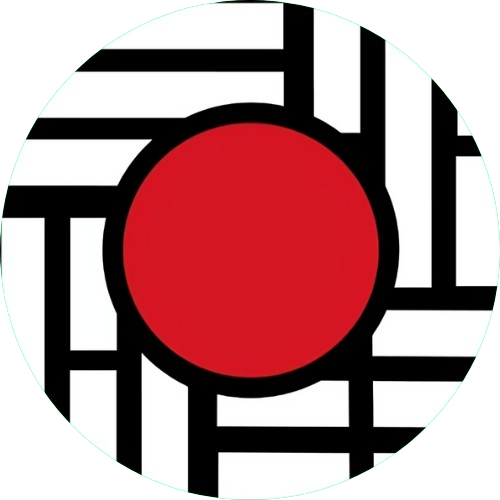

  

<h3 align="center">Japorea website</h3>

[!](https://github.com/JAPOREA/JAPOREA.github.io/pulls)

---

 A static website for japorea community
      

## 📝 Table of Contents

- [About](#about)
- [Built Using](#built_using)
- [TODO](../TODO.md)
- [Contributing](../CONTRIBUTING.md)
- [Authors](#authors)
- [Acknowledgments](#acknowledgement)

## 🧐 About 

Japorea is a club and community for Asian culture lovers, it's a part of live room project.

## ⛏️ Built Using 

- [HTML](https://developer.mozilla.org/en-US/docs/Web/HTML) - HyperText Markup Language
- [CSS](https://developer.mozilla.org/en-US/docs/Web/CSS) - Cascading Style Sheets
- [JAVASCRIPT](https://developer.mozilla.org/en-US/docs/Web/javascript) - Javascript

## ✍️ Authors 

- [@ilias-anouar](https://github.com/ilias-anouar) - Idea & Initial work

See also the list of [contributors](https://github.com/JAPOREA/JAPOREA.github.io/contributors) who participated in this project.

## 🎉 Acknowledgements 

- Hat tip to anyone whose code was used
- Inspiration
- References
